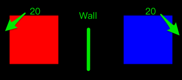
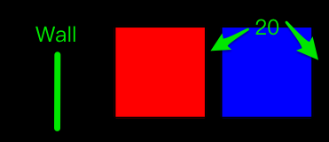
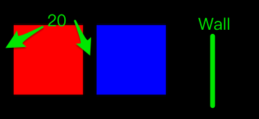

# AutoLayoutKit
使用 swift 编写的 AutoLayout 布局库

## 目录
* [其它布局库的问题](#other_lib_problem)
* [AutoLayoutKit 概览](#overview)
* [安装](#install)
* [使用](#how_to_use)
* [API 描述](#api_desc)

<a name="other_lib_problem"></a>
## 其它布局库的问题
iOS/OS X 开发中为了适应多种尺寸，会使用 AutoLayout。但系统提供的 AutoLayout API 太难用了，需要一定的封装。

已经有了很多 AutoLayout 的封装库，比如 Objective-C 编写的 [Masonry](https://github.com/SnapKit/Masonry)。Swift 编写的 [Cartography](https://github.com/robb/Cartography)。这些库本身很出色。

只是这些库用起来还是不够方便，它们的 API 每次调用只配置一两个 view 之间的关系，这点跟原生 API 没有什么本质区别。但事实上我们更关心界面的整体布局。比如下面这种简单的界面：


使用 Cartography 来写，大致写成：
	
```Swift
constraint(redView, blueView, yellowView) { red, blue, yellow in 
	let parent = red.superview!
	
	// 高度
	red.height == 44
	yellow.height == 44
	
	// x 方向约束
	red.left == parent.left
	red.right == parent.right
	
	blue.left == parent.left
	blue.right == parent.right
	
	yellow.left == parent.left
	yellow.right == parent.right
	
	// y 方向约束
	red.top == parent.top
	distribute(by: 0, vertically: red, blue, yellow)
	yellow.bottom == parent.bottom
}
```
	
这个写法已经比 NSLayoutConstraint 好太多了。但假如需要配置更多 view，并且 view 之间的间距并非相同，写起来就很越来越繁琐了。

AutoLayoutKit 更关心整体布局，一次处理多个 view, 上面例子可以写成。

```Swift
self.tk_constraint { make in
    make.height(redView, yellowView) == 44
    make.xEqual(redView, blueView, yellowView)
    make.yPlace(redView, blueView, yellowView)
}
```

<a name="overview"></a>
## AutoLayoutKit 概览
这个库的 API 故意设计成跟另一个库 [LayoutKit](https://github.com/hjcapple/LayoutKit) 相似，LayoutKit 使用 frame 来实现布局。假如你对这个库有兴趣，很可能会对 LayoutKit 也有兴趣。但使用 AutoLayout，在最开始是没有办法知道 View 的大小，也不可能方便地产生等间距的布局。

界面布局，大致分解成 3 步：

1. 设置大小。
2. 水平方向排列各个 views。
3. 垂直方向排列各个 views。

AutoLayoutKit 提供 API 来设置大小、水平位置、垂直位置。水平方向和垂直方向使用数轴的概念：

* 水平方向，就是 x 方向。
* 垂直方向，就是 y 方向。

API 设计中

* xLeft、xRight、xCenter、xPlace 等等就是设置 x 方向。
* yTop、yBottom、yCenter、yPlace 等等就是设置 y 方向。

### 一次设置多个 view

AutoLayoutKit 的 API 设计成一次设置多个 view 之间的关系。比如：

```Swift	
make.xLeft(redView, blueView, yellowView)
```
	
可以将传入的 views 都设置成靠左。最实用的是 xPlace 和 yPlace 函数。比如：

```Swift
make.xPlace(20, redView, make.wall, blueView, 20)
```
	
这样就产生下面的布局：



用 Cartography 的写法，相当于
	
```Swift
redView.left == parent.left + 20
blueView.right == parent.right - 20
```
	
xPlace 和 yPlace 可以很直观地连写任意数量的 view 和间距.

```Swift
make.xPlace(20, redView, blueView, 30, 30, yellowView, 30)
```	

这样就相当于调用。

```Swift
redView.left == parent.left + 20
blueView.left == redView.right + 0
yellowView.left == blueView.right + (30 + 30)
yellowView.right == parent.right - 30
```	

<a name="wall"></a>
### divider（或者叫墙 wall)
在 xPlace 中连写 view 或者间距，就会自动产生约束关系，比如

```Swift
make.xPlace(20, redView, blueView, 20)
```	
这样 redView 就距离边距 20 point, redView 和 blueView 连在一起。假如需要打断关系，让它们不相关，就需要在中间添加分隔符(divider)，另外一个更通俗的词就是墙(wall)。

```Swift	
make.divider
make.wall
```	
前面提到的例子：

```Swift
make.xPlace(20, redView, make.wall, blueView, 20)
```
redView 和 blueView 被阻隔，因此 redView 跟左边相连，就靠左边；blueView 跟右边相连，就靠右边。产生布局


而

```Swift
make.xPlace(make.wall, redView, 20, blueView, 20)
```

产生整体靠右布局。



```Swift
make.xPlace(20, redView, 20, blueView, make.wall)
```

产生整体靠左布局。



<a name="edges"></a>
### 边距 edges

最开始的时候上下左右边距都为 0，但可以通过 insetEdges 插入新的边距。比如：

```Swift
make.insetEdges(edge: 30)
make.equal(blueView)
    
make.insetEdges(edge: 30)
make.equal(redView)
```

bounds 先插入边距，放置 blueView, 再插入边距，再放置 redView, 就产生下面布局：


也可以分别设置上下左右的边距，之后通过 resetEdges 来还原 edges，比如：

```Swift
do {
    let oldEdges = make.insetEdges(top: 10, left: 20, bottom: 40, right: 50)
    defer {
        make.resetEdges(oldBounds)
    }
    // do something
}
```

### Constraint Group

每次调用 

```Swift
self.tk_constraint { make in 
	xxx
}
```
	
都会返回一个 Constraint Group，包含所有被安装的约束。比如

```Swift
let group = self.tk_constraint { make in 
	xxx
}
```

之后可以调用
	
```Swift
group.uninstall()
```
	
来删除所有的约束。或者之后替换掉约束，比如。

```Swift
class TestView3
{
	private let _group = AutoLayoutKitConstraintGroup()
	
    private func replaceConstraints()
    {
        self.tk_constraint(replace: _group) { make in
        	xxxx
        }
    }
}
```
	
这样调用 tk_constraint(replace: xxx), 之前产生的约束会自动被删除。替换上的约束。

<a name="install"></a>
## 安装

LayoutKit 只有一个独立文件，下载之后直接将 AutoLayoutKit/AutoLayoutKit.swift 添加到工程中。

<a name="how_to_use"></a>
## 使用
调用

```Swift
superview.tk_constraint { make in 
	make.
}
```
	
或者替换约束

```Swift
self.tk_constraint(replace: _group) { make in
	xxxx
}
```
    
<a name="api_desc"></a>
## API 描述

上面提到，界面布局大致分解成 3 步：

1. 设置大小。
2. x 方向排列各个 views。
3. y 方向排列各个 views。

AutoLayoutKit 也就提供 API 分别完成这三个步骤，而 x 排列和 y 排列是对称的。

采用 AutoLayout, 很多时候大小是根据内容自动设置的，并不需要自己设置。比如单行 Label, 系统可以根据文字内容得到大小。

### 修改 edges

```Swift
func insetEdges(top top: CGFloat, left: CGFloat, bottom: CGFloat, right: CGFloat) -> EdgeInsets
func insetEdges(edge edge: CGFloat) -> EdgeInsets
```

上面已经有[边距 edges](#edges)的描述，上面两个 API 是中插入边距，并返回旧的 edges。

```Swift
func resetEdges(edges: EdgeInsets)
```
	
也可以直接设置 edges, 通常用于还原旧的 edges。

### 取得的高度和宽度代理

```Swift
make.w // 高度
make.h // 高度
```
	
比如想将 redView 设置成父view大小的 1/2 大小。可以写成

	make.size(redView) == (make.w * 0.5, make.h * 0.5)
	
### 设置 size
用法：

```Swift	
make.size(view0, view1, view2) == CGSizeMake(100, 100)
```
	
将所有 views 设置成对应的大小。另外可以简写，去掉 CGSizeMake。

```Swift
make.size(view0, view1, view2) == (100, 100)
```

另外可以设置高宽代理。比如

```Swift
make.size(view0, view1, view2) == (make.w * 0.5, make.h * 0.5)
```
	
也可以传入数组，比如

```Swift
let views = [view0, view1, view2]
make.size(views) == (100, 100)
```
	
所有 API 中，假如可以连写多个 views，都可以用数组作为参数，下面不再多说。


### 设置 width

用法
	
```Swift
make.width(view0, view1, view2) == 10
```
	
将所有 views 都设置成同一个值。

另外也可以将 view 独自设置，如：

```Swift
make.width(view0, view1, view2) == [10, 20, 30]
make.width(view0, view1, view2) == [10, 20, make.w * 0.5]
```
	
左右参数个数不相等时，会不设置多余的参数。比如：

```Swift
make.width(view0, view1) == [10, 20, 30]
```
	
这样会忽略右边多余的 30。

### 设置 height
height 的设置跟 width 对称。

### 取得分隔符

```Swift
make.wall
```

或者

```Swift
make.wall
```

divider 的概念[见上文](#wall)。

### xLeft, xRight, xCenter

传入的 views 在 x 方向，靠左、靠右、居中。

比如

```Swift
make.xCenter(view0, view1, view2)
```

### yTop, yBottom, yCenter

传入的 views 在 y 方向，靠上、靠下，居中。

比如

```Swift
make.yCenter(view0, view1, view2)
```

### center

在 x, y 方向上都居中，相等于先调用 xCenter 再调用 yCenter。

### xPlace

在 x 方向上，从左到右放置各个 views，并设置好间距。

比如

```Swift
make.xPlace(10, view0, 10, view2, make.wall, view3)
```
	
关于 make.wall 的描述，[见上文](#wall)。

### yPlace
用法跟 xPlace 一致。只是处理 y 方向。

### ref

以某个 view 为基准，对齐其它 views。比如：

```Swift
make.ref(labe0).xLeft(label1, label2, label3)
```	
	
这样 label1, label2, label3 跟 label0 左对齐。另外

```Swift
make.ref(labe0).xRight(label1, label2, label3)
```
	
这样 label1, label2, label3 跟 label0 右对齐。

其它的 
	
```Swift
make.ref(xxx).yTop
make.ref(xxx).yBottom
make.ref(xxx).xCenter
```
	
等等意义也是一样。

### xEqual

在 x 方向上，使得 views 的宽度跟父 view 一致，并且靠边。相当于连续调用 xLeft 和 xRight。

```Swift
make.xEqual(view0, view1, view2)
```
	
相当于

```Swift
make.xLeft(view0, view1, view2)
make.xRight(view0, view1, view2)
```

### yEqual

跟 xEqual 对称。

### equal

使得 views 直接占据整个区域。相当于同时调用，xEqual 和 yEqual。这个函数，跟 insetEdges 配合起来很容易设置边距。比如

```Swift
make.insetEdges(edge: 20)
make.equal(redView)
```

这样，就将 redView 设置成距离边距 20。

### AutoLayoutKitAttribute
上面提到的 API 已经可以配置绝大部分的布局。但假如有些约束上面 API 表示不了，可以使用更基本的 AutoLayoutKitAttribute。

比如 

```Swift
let left = AutoLayoutKitAttribute(leftView, .Left)
let right = AutoLayoutKitAttribute(rightView, .Right) - 10
make.install(left, right)
```
	
这样就相当于设置了约束。

```Swift
leftView.left == rightView.right - 10
```
	
或者你想产生原生的 NSLayoutConstraint。可以写成

```Swift
let left = AutoLayoutKitAttribute(leftView, .Left)
let right = AutoLayoutKitAttribute(rightView, .Right) - 10
let constraint0 = (left == right)
let constraint1 = (left >= right)
let constraint2 = (left <= right)
```

另外 AutoLayoutKit-ext.swift 文件中也包含一些扩展，

	leftView.tk_left
	
等价于

	AutoLayoutKitAttribute(leftView, .Left)
	
将这些简便方法分离到其它文件中，可以选择是否包含到工程。
	
 

